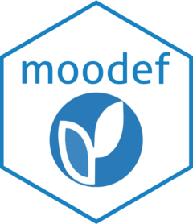

<!-- README.md is generated from README.Rmd. Please edit that file -->

# moodef 

<!-- badges: start -->

[](https://CRAN.R-project.org/package=moodef)
[](https://github.com/josesamos/moodef/actions/workflows/R-CMD-check.yaml)
[](https://app.codecov.io/gh/josesamos/moodef)
[](https://www.r-pkg.org:443/pkg/moodef)
<!-- badges: end -->

The goal of the `moodef` package is to support the definition of
[*Moodle*](https://moodle.org/) elements taking advantage of the power
that R offers. In particular, in this first version, it allows the
definition of questions to be included in the question bank to define
quizzes.

To define the questions for the quizzes we can use the component for
this purpose that includes *Moodle*, based on entering data through
screens. It allows the import and export of questions in various
formats, including XML.

Complementary, using the `moodef` package, we can define questionnaires
from R. We have generalized 10 types of questions and simplified their
definition. So, we define a question by calling a function or simply
including a row in a data frame, a CSV file or an *Excel* file. The
result is an XML file that we import into *Moodle*. If necessary, some
parameter not considered in the generalization can be defined or
adjusted there.

The package supports two styles of question definition: the simple style
and the extended style. The following example is based on the simple
style.

Although not shown in the next example, in each question we can include
an image that is embedded in XML. We can set up the size of the images
so that they are homogeneous when displayed in quizzes.

In addition to facilitating the definition of questions manually, the
infrastructure offered by this package can be used to generate questions
automatically or semi-automatically from R.

## Installation

You can install the released version of `when` from
[CRAN](https://CRAN.R-project.org) with:

``` r
install.packages("moodef")
```

And the development version from [GitHub](https://github.com/) with:

``` r
# install.packages("pak")
pak::pak("josesamos/moodef")
```

## Example

This is a basic example which shows the definition of a question using
the function:

``` r
library(moodef)

qc <- question_category(category = 'Initial test',
                        copyright = 'Copyright © 2025 Universidad de Granada',
                        license = 'License Creative Commons Attribution-ShareAlike 4.0',
                        author = 'Jose Samos') |>
  define_question(
    question = 'What are the basic arithmetic operations?',
    answer = 'Addition, subtraction, multiplication and division.',
    a_1 = 'Addition and subtraction.',
    a_2 = 'Addition, subtraction, multiplication, division and square root.'
  )

file <- tempfile(fileext = '.xml')
qc <- qc |>
  generate_xml_file(file)
```

First, we create an object using the `question_category` function and
configure general aspects of the definition in it. Next, we define the
questions, as many as we need, using the `define_question` function (the
type of the questions is deduced from the definition). Finally, we
generate the questions in XML format, in the form of a string or file.
We show the result below.

``` xml
<?xml version="1.0" encoding="UTF-8"?>
<quiz>
  <question type="category">
    <category>
      <text>$course$/top/Initial test</text>
    </category>
    <info format="html">
      <text></text>
    </info>
    <idnumber></idnumber>
  </question>
  <question type="multichoice">
    <name>
      <text>q_001_multichoice_what_are_the_basic_arithmetic_operations</text>
    </name>
    <questiontext format="html">
      <text><![CDATA[
        <!-- Copyright © 2025 Universidad de Granada -->
        <!-- License Creative Commons Attribution-ShareAlike 4.0 -->
        <!-- Author: Jose Samos -->
        <p>What are the basic arithmetic operations?</p>
      ]]></text>
    </questiontext>
    <generalfeedback format="html">
      <text></text>
    </generalfeedback>
    <defaultgrade>1.0</defaultgrade>
    <penalty>0.5</penalty>
    <hidden>0</hidden>
    <idnumber></idnumber>
    <single>true</single>
    <shuffleanswers>true</shuffleanswers>
    <answernumbering>abc</answernumbering>
    <showstandardinstruction>0</showstandardinstruction>
    <correctfeedback format="moodle_auto_format">
      <text>Correct.</text>
    </correctfeedback>
    <partiallycorrectfeedback format="moodle_auto_format">
      <text>Partially correct.</text>
    </partiallycorrectfeedback>
    <incorrectfeedback format="moodle_auto_format">
      <text>Incorrect.</text>
    </incorrectfeedback>
    <answer fraction="100" format="html">
      <text>Addition, subtraction, multiplication and division.</text>
      <feedback format="html">
        <text>Correct.</text>
      </feedback>
    </answer>
    <answer fraction="-50.000000000000000" format="html">
      <text>Addition and subtraction.</text>
      <feedback format="html">
        <text>Incorrect.</text>
      </feedback>
    </answer>
    <answer fraction="-50.000000000000000" format="html">
      <text>Addition, subtraction, multiplication, division and square root.</text>
      <feedback format="html">
        <text>Incorrect.</text>
      </feedback>
    </answer>
  </question>
</quiz>
```

We can call the `define_question` function for each question to be
defined, with the same parameters. Alternatively, we can create a data
frame, a CSV file or an *Excel* file (with the functions available in
the package) and include in them a row for each question, a column for
each parameter. Below is the content of a CSV file in table format.

<div style="font-size: small;">

| type | question | image | image_alt | answer | a_1 | a_2 |
|:---|:---|:---|:---|:---|:---|:---|
|  | What are the basic arithmetic operations? |  |  | Addition, subtraction, multiplication and division. | Addition and subtraction. | Addition, subtraction, multiplication, division and square root. |
|  | Match each operation with its symbol. |  |  | Addition\<\|\>+ | Subtraction\<\|\>- | Multiplication\<\|\>\* |
|  | The square root is a basic arithmetic operation. |  |  | False |  |  |
|  | What basic operation does it have as a + symbol? |  |  | Addition |  |  |
|  | The symbol for addition is \[\[1\]\], the symbol for subtraction is \[\[2\]\]. |  |  | \+ | \- |  |
| x | The symbol for addition is \[\[1\]\], the symbol for subtraction is \[\[2\]\]. |  |  | \+ | \- |  |
| h | Sort the result from smallest to largest. |  |  | 6/2 | 6-2 | 6+2 |
| v | Sort the result from smallest to largest. |  |  | 6/2 | 6-2 | 6+2 |
|  | What is the result of SQRT(4)? |  |  | 2 | -2 |  |
|  | What is the result of 4/3? |  |  | 1.33\<\|\>0.03 |  |  |
|  | Describe the addition operation. |  |  |  |  |  |

</div>

The generation of the questions would be similar, as shown below.

``` r
file <- system.file("extdata", "questions.csv", package = "moodef")
qc <- question_category(category = 'Initial test',
                        copyright = 'Copyright © 2025 Universidad de Granada',
                        license = 'License Creative Commons Attribution-ShareAlike 4.0',
                        author = 'Jose Samos') |>
  define_questions_from_csv(file = file)

file <- tempfile(fileext = '.xml')
qc <- qc |>
  generate_xml_file(file)
```

We do not show the content of the XML file obtained because in that
example there are several questions defined and it takes up a lot of
space.
